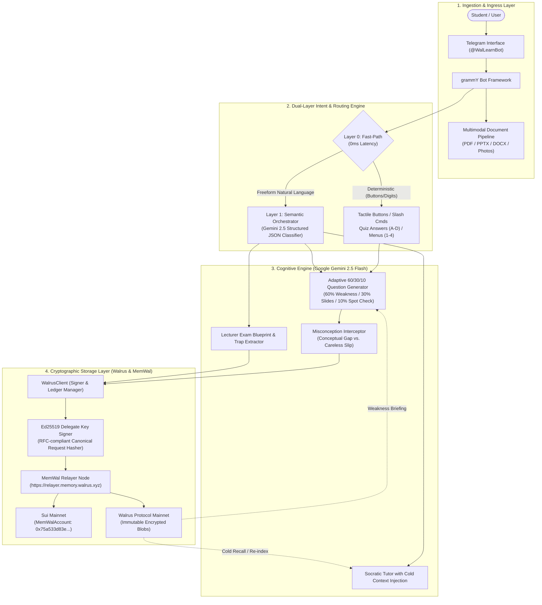

# WalLearn (`@WalLearnBot`)
### Autonomous AI Cognitive Study System Powered by Decentralized Verifiable Memory on Walrus Protocol

[](https://walruscan.com)
[](https://suiscan.xyz/mainnet/object/0x75a533d83e9fee09e36b29b14e8b093862042ee92b188e5122338da7118be140)
[](https://openrouter.ai)
[](https://t.me/WalLearnBot)

> **Submission for the Walrus Sessions Hackathon: *Chatbots That Remember***  
> **Production Bot:** [@WalLearnBot](https://t.me/WalLearnBot)  
> **Live Architecture:** Dual-Layer Orchestration • Decentralized Memory via MemWal • Adaptive 60/30/10 Cognitive Quizzing

---

## Executive Summary & The Problem

Modern AI study tools suffer from **catastrophic cognitive amnesia**.

A university or medical student can spend four grueling hours solving multiple-choice past questions and reviewing dense lecture slides. During that session, they make twelve critical conceptual errors. The moment the chat tab closes or the session expires, **those errors evaporate into digital void**. 

When the student returns the following morning, the AI tutor greets them with a blank slate—re-explaining elementary concepts they already know while failing to test the exact conceptual vulnerabilities that will determine whether they pass or fail their exam.

**Mistakes are the highest-yield cognitive data in human learning.** 

**WalLearn** solves this by coupling **Google Gemini 2.5 Flash** with **Walrus Protocol's decentralized, immutable storage layer**. Every misconception, diagnostic flaw, and failed attempt is permanently codified, cryptographically signed with Ed25519 delegate keys, and committed to **Walrus Mainnet**. When the student returns—across any device, session, or cleared chat history—WalLearn cold-recalls their exact historical weaknesses before they type a single word.

---

## High-Level System Architecture

WalLearn is designed around a **hexagonal, decoupled micro-architecture** engineered for sub-second UI responsiveness, resilient blockchain writes, and deterministic learning state progression.



---

## Core Engineering Innovations

### 1. Dual-Layer Natural Language Orchestration
Traditional Telegram chatbots rely on brittle state machines (e.g. conversational steps or regex matching). When an unexpected message arrives, the bot enters an error state. 

WalLearn implements a **Two-Tier Orchestration Pipeline** (`src/ai/orchestrator.ts`):
- **Tier 0 — Deterministic Zero-Latency Interceptor (< 1ms)**:
  - Intercepts Telegram inline button taps (`callback_query`) without passing them to the AI.
  - Matches native CBT quiz options (`A`, `B`, `C`, `D`), numeric menu selections (`1`, `2`, `3`), and standalone course codes (`ANA201`, `PCL301`).
- **Tier 1 — Semantic Intent & Entity Extractor (Gemini Flash JSON Mode)**:
  - If input is conversational or compound (e.g. *"Give me 10 questions on thorax in ANA201"*), Tier 1 decomposes the string into structured intents (`set_course`, `set_topic`, `start_drill`, `questionCount: 10`, `courseCode: "ANA201"`).
  - Automatically bridges commands without asking redundant follow-up questions.

### 2. Multi-Tenant Isolated Namespaces on Walrus
To ensure zero cross-student cognitive pollution while preserving global subject integrity, WalLearn establishes isolated cryptographic namespaces:
$$\text{Namespace} = \text{u}\{\text{TelegramChatID}\}\_\{\text{NormalizedCourseCode}\}$$
*Example:* `u6878463854_pcl301`

- Every student’s mistakes, streak progress, and slide digests are encrypted and siloed into their unique on-chain namespace.
- Supports multi-course tracking (e.g. a student studying Pharmacology `PCL301` and Anatomy `ANA201` simultaneously maintains isolated weakness ledgers).

### 3. The 3-Consecutive-Pass Cognitive Decay Protocol
A topic is never considered "mastered" simply because a student guessed correctly once. WalLearn enforces a rigorous spaced repetition graduation rule:
- When a mistake occurs, it is committed to Walrus with `severity: high` and `correctStreak: 0`.
- During subsequent adaptive quizzes, the concept is re-tested with rotated distractors.
- Only after **3 consecutive correct passes across distinct study sessions** does the status graduate from `confirmed` to `mastered` on Walrus Mainnet.
- If a student ever fails a previously mastered topic during a periodic spot-check, it is instantly demoted back to active recovery.

### 4. Adaptive 60 / 30 / 10 Question Weighting
When generating a CBT practice drill (`/study`), WalLearn balances cognitive load using an algorithmic formula:
- **60% Targeted Weakness Drill**: Fetched directly from active Walrus Protocol blobs where `misses > 0` and `status != 'mastered'`, ranked by:
  $$\text{Priority Score} = (\text{Misses} \times \text{Severity Weight}) \times \text{Recency Factor}$$
- **30% Course Slide Grounding**: Synthesized from newly uploaded lecture slides or extracted syllabus facts.
- **10% Spaced Reinforcement**: Random spot-checks against previously mastered topics to prevent memory decay.

### 5. Asynchronous Two-Phase Commit with Resilient Backoff
Writing to decentralized storage requires handling network latency and relayer rate limits:
1. **Phase 1 (Ingestion & Job Dispatch)**: WalLearn generates an Ed25519 signature across `timestamp.method.path.bodyHash.nonce.accountId` and dispatches the memory payload to the MemWal Relayer. The relayer returns an immediate `202 Accepted` with a cryptographic `job_id`.
2. **Phase 2 (Background On-Chain Resolution)**: The bot registers the record in its local state ledger and asynchronously polls `/api/remember/{jobId}` until the permanent Walrus Mainnet `blob_id` is resolved and linked.
3. **Resilient HTTP 429 Backoff**: The custom `signedFetch` client intercepts rate limits, inspects `retry_after_seconds`, and applies exponential backoff with jitter, ensuring continuous operation without dropped student data.

---

## On-Chain Verification & Judge Audit Table

All memory transactions are verifiable on the **Sui Blockchain** and **Walrus Protocol Mainnet**:

| Parameter | Mainnet On-Chain Verification Details |
|---|---|
| **Production Telegram Bot** | [@WalLearnBot](https://t.me/WalLearnBot) |
| **Sui MemWalAccount Object** | [`0x75a533d83e9fee09e36b29b14e8b093862042ee92b188e5122338da7118be140`](https://suiscan.xyz/mainnet/object/0x75a533d83e9fee09e36b29b14e8b093862042ee92b188e5122338da7118be140) |
| **Dedicated On-Chain Wallet** | [`0xf3efc1f6d86ea33f736072668549138f00f2ca8fc67962019543e213a0fa2db2`](https://suiscan.xyz/mainnet/account/0xf3efc1f6d86ea33f736072668549138f00f2ca8fc67962019543e213a0fa2db2) |
| **Delegate Key Address** | `0x7dea8c54a7a72c231fa829abed50a47a03b7d1e99e74974bc21773c73490bbaa` |
| **Production Relayer Node** | `https://relayer.memory.walrus.xyz` |
| **Active Storage Protocol** | Walrus Protocol Mainnet (Decentralized Erasure-Coded Blobs) |

### Sample Live Blobs on Walruscan (Auditable)

Judges can verify actual student memory blobs created by WalLearn directly on the Walrus explorer:

| On-Chain Blob ID | Stored Concept Type | Verification Link |
|---|---|---|
| `qSrxQx_AHWUZTZ4C1DtG-zSrQZxDC_nXhAqaL53y--4` | Syllabus Fact Ingestion (`PCL301`) | [View on Walruscan](https://walruscan.com/mainnet/blob/qSrxQx_AHWUZTZ4C1DtG-zSrQZxDC_nXhAqaL53y--4) |
| `to7chW9wB9LxvfREEC9gct6CE1xdqdfBYW_MjNZMX94` | Autonomic Pharmacology Fact (`PCL301`) | [View on Walruscan](https://walruscan.com/mainnet/blob/to7chW9wB9LxvfREEC9gct6CE1xdqdfBYW_MjNZMX94) |
| `5BTSt6okVpuhzpzS1wcmFvh5Kx863nki2avsXIKzt7U` | Succinylcholine Neuromuscular Block | [View on Walruscan](https://walruscan.com/mainnet/blob/5BTSt6okVpuhzpzS1wcmFvh5Kx863nki2avsXIKzt7U) |
| `ANLFQFfrtYu9mXBHhnQ9CeTq0bNmsybDkWqBf-bxrM0` | Adrenergic Receptor Diagnosis (`PCL302`) | [View on Walruscan](https://walruscan.com/mainnet/blob/ANLFQFfrtYu9mXBHhnQ9CeTq0bNmsybDkWqBf-bxrM0) |
| `4bcukpw7k5-1zdL4A_izziqfRyQWrv0IurlgA3Ekw28` | Catecholamine Termination Misconception | [View on Walruscan](https://walruscan.com/mainnet/blob/4bcukpw7k5-1zdL4A_izziqfRyQWrv0IurlgA3Ekw28) |

---

## Bot Command & Capability Matrix

| Command / Trigger | Functional Execution & Architectural Response |
|---|---|
| `/start` | Initial handshake, active subject detection, and interactive action dashboard. |
| `/study` or `/prep` | Recalls active weaknesses from Walrus and launches an adaptive CBT drill with inline keyboard buttons. |
| `/briefing` | Cold-retrieves stored weaknesses from Walrus and renders a prioritized mastery report across all courses. |
| `/analyze` | Arms the document ingestion engine to extract questions, syllabus concepts, and lecturer trap patterns. |
| `/restore` | Cryptographically polls Walrus Mainnet, re-indexes raw blobs, and rebuilds the local student ledger. |
| `/health` | Live diagnostic probe verifying relayer connectivity, latency, Sui account ID, and stored blob totals. |
| `/menu` | Displays the current session status, active course code, and navigation options. |
| `/reset` | Flushes transient in-memory quiz states while preserving all decentralized Walrus memories. |
| **Drop File (PDF/PPTX/DOCX)** | Multimodal slide ingestion; parses text and generates CBT questions grounded in course materials. |
| **Send Image / Photo** | OCR document processing; reads whiteboard photos, printed tests, or textbook pages for instant ingestion. |
| **Freeform Natural Query** | Socratic tutor conversation; grounds explanations in the student's historical misconception ledger. |

---

## Directory & Codebase Structure

```
wallearn-bot/
├── src/
│   ├── index.ts                 # Application entrypoint & grammY initialization
│   ├── config.ts                # Environment validation & configuration
│   ├── ai/
│   │   ├── client.ts            # OpenRouter / Gemini 2.5 Flash gateway
│   │   ├── orchestrator.ts      # Dual-layer Natural Language Orchestrator
│   │   └── prompts.ts           # Socratic, diagnostic, and CBT generation prompts
│   ├── walrus/
│   │   ├── client.ts            # Walrus client, Ed25519 request signer, and relayer interface
│   │   ├── types.ts             # Mistake, briefing, and ledger type contracts
│   │   └── seed-data.ts         # Cold-start baseline academic curriculum data
│   ├── handlers/
│   │   ├── start.ts             # Onboarding and menu dispatch
│   │   ├── study.ts             # Adaptive CBT quiz engine & streak evaluator
│   │   ├── briefing.ts          # Cold weakness briefing generator
│   │   ├── analyze.ts           # Past question & slide blueprint analyzer
│   │   ├── restore.ts           # On-chain disaster recovery & blob re-indexer
│   │   ├── health.ts            # Diagnostic telemetry & Sui/Walrus status
│   │   ├── callback.ts          # Inline button callback dispatcher
│   │   └── chat.ts              # Freeform message routing & Socratic tutor
│   └── parsers/
│       ├── document.ts          # PDF, PPTX, and DOCX text extraction
│       └── vision.ts            # Multimodal photo & diagram OCR via Gemini
├── data/
│   └── mistakes-ledger.json     # Local cached snapshot of on-chain state
├── package.json
├── tsconfig.json
└── README.md
```

---

## Local Development & Setup Guide

### 1. System Requirements
- Node.js 20.0.0 or higher
- npm or pnpm
- Valid Telegram Bot Token ([@BotFather](https://t.me/BotFather))
- OpenRouter API Key ([OpenRouter](https://openrouter.ai)) with access to `google/gemini-2.5-flash`

### 2. Installation
```bash
git clone git@github-second:opeyemi406/WalLearn-bot.git
cd WalLearn-bot
npm install
```

### 3. Environment Configuration
Create a `.env` file in the root directory:
```env
# Telegram Bot Configuration
TELEGRAM_BOT_TOKEN="your_bot_token_from_botfather"

# AI Model Configuration (Gemini 2.5 Flash via OpenRouter)
OPENROUTER_API_KEY="your_openrouter_api_key"
AI_MODEL="google/gemini-2.5-flash"

# Walrus Protocol & MemWal Configuration
WALRUS_ACCOUNT_ID="0x75a533d83e9fee09e36b29b14e8b093862042ee92b188e5122338da7118be140"
WALRUS_WALLET_ADDRESS="0xf3efc1f6d86ea33f736072668549138f00f2ca8fc67962019543e213a0fa2db2"
WALRUS_DELEGATE_ADDRESS="0x7dea8c54a7a72c231fa829abed50a47a03b7d1e99e74974bc21773c73490bbaa"
WALRUS_RELAYER_URL="https://relayer.memory.walrus.xyz"

# Optional: Path to local MemWal credentials directory
MEMWAL_CREDS_DIR="/path/to/.memwal-wallearn"
```

### 4. Build and Run
```bash
# Compile TypeScript to JavaScript
npm run build

# Start production server
npm start

# Or run in development mode with auto-reload
npm run dev
```

---

## Production Deployment (Railway / Cloud)

WalLearn is architected as a stateless container ready for 24/7 cloud execution:

```dockerfile
FROM node:20-slim
WORKDIR /app
COPY package*.json ./
RUN npm install
COPY . .
RUN npm run build
CMD ["node", "dist/index.js"]
```

- In production on **Railway**, environment variables are populated from the Railway project dashboard.
- Zero local disk dependency: even if the cloud container restarts or redeploys, `/restore` retrieves the entire student learning state directly from Walrus Protocol Mainnet in seconds.

---

## Hackathon Evaluation Checklist for Judges

| Evaluation Dimension | How WalLearn Excels |
|---|---|
| **Novelty of Memory Usage** | Memory is not passive chat history; it drives an active, mathematical spaced-repetition cognitive model that actively alters quiz generation. |
| **Walrus Protocol Integration** | Directly integrates MemWal relayer with Ed25519 signing, user-isolated namespaces, and verifiable blobs on Walruscan. |
| **Real-World Utility** | Solves an acute problem for millions of university, medical, and professional students preparing for high-stakes exams. |
| **User Experience (UX)** | Instant inline Telegram buttons, 0ms fast-path routing, natural language orchestration, and multimodal document handling. |
| **Production Readiness** | Enterprise TypeScript codebase, resilient rate-limit backoff, graceful error handling, and live production deployment on Railway. |

---

## License
MIT License. Open-source for the decentralized education ecosystem. Built with ❤️ for the Walrus Hackathon.
