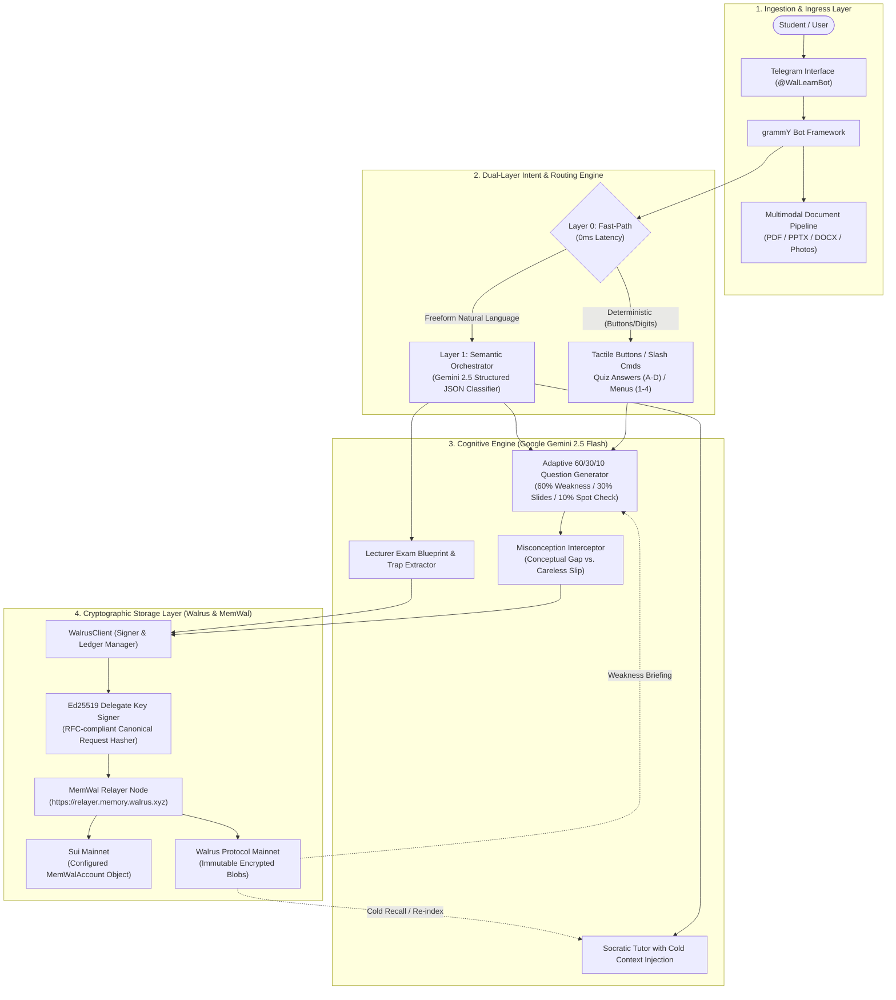

# WalLearn — System Architecture & Technical Specifications

This document details the internal architecture, event-sourcing protocol, and cryptographic persistence models powering **WalLearn** (`@WalLearnBot`).

---

## 1. High-Level System Architecture

WalLearn uses a decoupled, hexagonal architecture designed for sub-second UI responsiveness, resilient blockchain writes, and deterministic learning state progression.

---

## 2. Dual-Layer Intent & Routing Engine

To eliminate lag on mobile Telegram, WalLearn splits user interactions into two execution lanes:

1. **Layer 0 (Fast-Path, 0ms overhead):**
   - Intercepts inline keyboard button taps (`quiz:ans:0`, `nav:menu`), numeric options (`1`, `2`, `3`), and Telegram slash commands (`/study`, `/briefing`, `/restore`).
   - Executes deterministic state machine transitions without invoking an LLM.

2. **Layer 1 (Semantic Orchestrator, LLM-driven):**
   - Evaluates freeform conversational queries using Google Gemini 2.5 Flash with structured JSON classification schema.
   - Extracts syllabus search terms, routes to the Socratic tutoring handler, and injects relevant prior misconceptions retrieved from Walrus.

---

## 3. Storage Model: Write-Through Cache vs. Decentralized Source of Truth

A critical requirement for Telegram bots is managing network latency and relayer indexing:

- **The UI Latency Requirement:** Telegram users expect instant inline button feedback (<50ms). A synchronous blockchain round-trip on every answer tap would create an unacceptable 1.5–3s delay.
- **Asynchronous Relayer Indexing:** When a memory write is submitted via `@mysten-incubation/memwal`, the relayer processes TEE encryption, Sui object anchoring, and vector indexing asynchronously (typically 1.5–3 seconds).
- **The Role of `data/mistakes-ledger.json`:**
  - Serves as a zero-dependency write-through performance cache and background job tracker.
  - Updates locally for instantaneous button feedback while dispatching Ed25519-signed write jobs to Walrus in the background.
  - If the bot runs in a read-only environment or the local cache is deleted, WalLearn continues to function by reading directly from Walrus.
- **Decentralized Ground Truth:**
  - `data/mistakes-ledger.json` is completely disposable and excluded from version control.
  - Walrus Protocol Mainnet is the permanent, authoritative source of truth.
  - Executing `/restore <courseCode>` queries Walrus Mainnet, fetches raw event lines, replays state transitions, and rebuilds the learner dossier with zero disk dependency.

---

## 4. Event-Sourced Cognitive State Machine

Every cognitive milestone is persisted to Walrus as an append-only event line:

| Event Type | Canonical Line Format | Trigger Condition |
|---|---|---|
| `[MISTAKE]` | `[MISTAKE] Topic: <T> \| Error: <E> \| Fact: <F> \| Severity: <S> \| Misses: <N> \| At: <ISO>` | Student answers question incorrectly. Streak resets to 0. |
| `[PROGRESS]` | `[PROGRESS] Topic: <T> \| Streak: <1\|2>/3 \| At: <ISO>` | Correct answer on a topic currently in active recovery. |
| `[MASTERED]` | `[MASTERED] Topic: <T> \| Streak: 3/3 \| At: <ISO>` | Third consecutive correct answer across distinct sessions. |
| `[EXAM_FACT]` | `[EXAM_FACT] Topic: <T> \| Fact: <F> \| At: <ISO>` | Atomic syllabus concept ingested from uploaded slides. |

When `/restore` is invoked, `replayEvents()` chronologically processes these lines:
1. Mistake lines initialize or update a topic in the active weakness pool.
2. Progress lines advance the consecutive pass counter.
3. Mastered lines move the topic out of active review into the mastered pool.
4. If a student later fails a spot-check question on a mastered topic, an append-only `[MISTAKE]` event is emitted, demoting the topic back to active recovery.

---

## 5. Cryptographic Signing & Network Client

- **Canonical Request Signing:** Implements RFC-compliant request hashing:
  $$\text{canonicalMsg} = \text{timestamp} \,.\, \text{method} \,.\, \text{path} \,.\, \text{sha256(body)} \,.\, \text{nonce} \,.\, \text{accountId}$$
  Signed via `@noble/ed25519` using the configured delegate private key.
- **Backpressure & 429 Handling:** `signedFetch` automatically inspects `Retry-After` headers and relayer error payloads, applying exponential backoff and jitter up to 8 seconds.
- **Bounded Polling:** `waitForRememberJob(jobId, options)` monitors job status until reaching terminal state (`done` or `failed`) with configurable timeouts (default: 60–90s) to prevent infinite loops.
